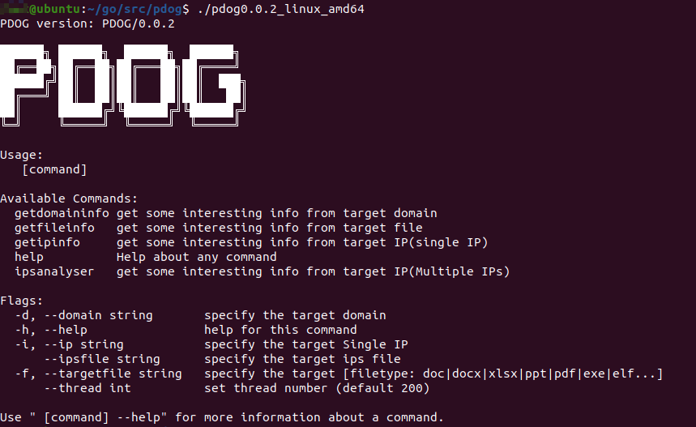
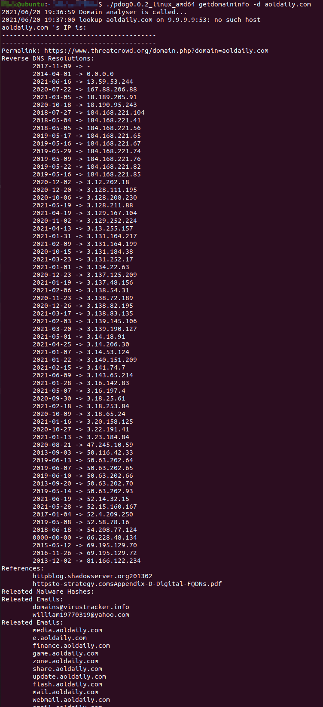
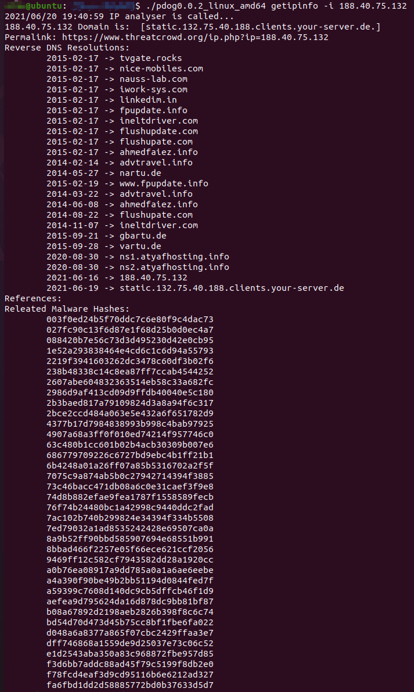
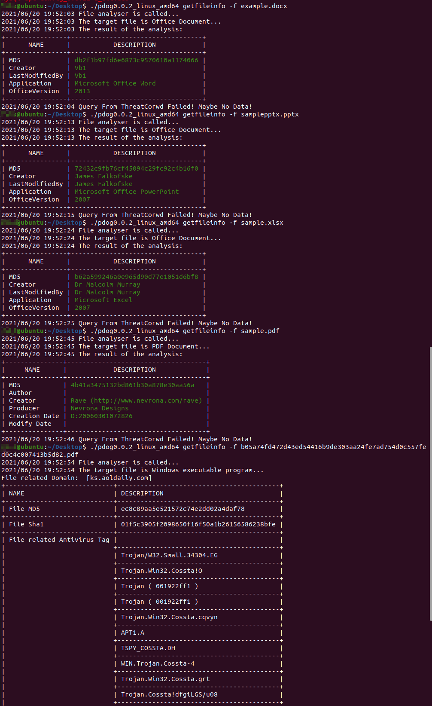
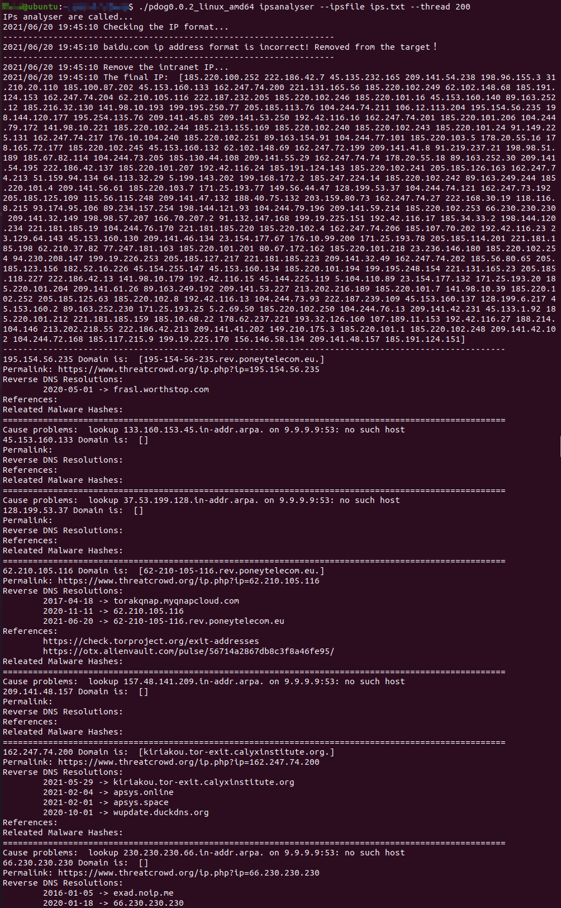

# pdog


pdog -> Threat Intelligence

pdog -> OSINT

It's an auxiliary tool ,and it helps the blue team track  the attackers

---------------------

## Example

useage:

```
Usage:
   [command]

Available Commands:
  getdomaininfo get some interesting info from target domain
  getfileinfo   get some interesting info from target file
  getipinfo     get some interesting info from target IP(single IP)
  help          Help about any command
  ipsanalyser   get some interesting info from target IP(Multiple IPs)

Flags:
  -d, --domain string       specify the target domain
  -h, --help                help for this command
  -i, --ip string           specify the target Single IP
      --ipsfile string      specify the target ips file
  -f, --targetfile string   specify the target [filetype: doc|docx|xlsx|ppt|pdf|exe|elf...]
      --thread int          set thread number (default 200)

Use " [command] --help" for more information about a command.

```


Logo:



domain:



IP:



Office Documents:



IPS:



---------------------

Questions:

Q: invalid character '<' looking for beginning of value


A: set proxy in the terminal(if network is blocked)

---------------------


